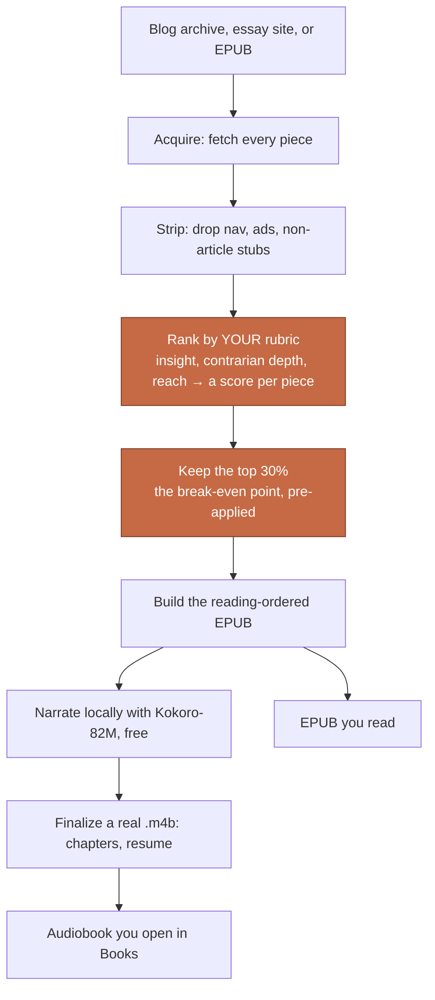

# Read the Best First

English | [中文](README.zh-CN.md)

A Claude Code skill set that turns a writer's collected essays into an inspiration-ranked audiobook, narrated for free by [Kokoro-82M](https://huggingface.co/hexgrad/Kokoro-82M), the open-weight local TTS model this project gratefully builds on.

*How much of a great thinker's collected work is actually worth your time?*

Less than half. Often far less.

## Why this exists

In the AI era, the bottleneck is no longer information or tools. The bottleneck is us. So the rational move is to learn from the strongest thinkers alive or dead, and to absorb their essence in the shortest possible time.

But even the strongest thinkers live in bubbles. Take anyone who has been brilliant in one field for decades and compress their lifetime of writing. What remains is a small set of essential pieces. The rest repeats those pieces, or commercializes them. This is not an insult. It is how careers work, and it means most of what any author published is not the reason you came.

So reading anyone's collected work has a **break-even point**, the moment your time stops earning its return. You cannot compute that point in advance. You only feel it while reading. What you can do is arrange the reading so the point comes to you. Sort every piece by inspiration, descending, and read from the top. The moment you feel the marginal value fade, put the book down. Everything past that point was going to be weaker anyway, by construction.

That is why chronological order, which is what every blog archive and every collected-works edition gives you, is the wrong order for a reader whose time is scarce. And it is why this tool became possible now. Having an LLM read into all 232 essays and rank them costs a few minutes and a few cents.

One more thing, and it is the point of the whole repo. The ranking runs on a rubric, and **the rubric is personal**. Mine scores unique insight, contrarian depth, and philosophical reach, because that is what I want to hit first. Yours is different.

> [!IMPORTANT]
> **The rubric is not a config detail. The rubric is the product.**
> The first thing to do with this repo is edit [`rubrics/inspiration.md`](rubrics/inspiration.md): its dimensions, weights, vetoes, and scoring policy are all yours to change.

## What it is

This tool was built for **curated blog and essay collections**: point it at an author's archive, an LLM reads the opening of every piece and ranks it by inspiration density, and out comes a reading-ordered EPUB plus a real .m4b audiobook (chapters you can skip between, a spot it remembers, not one 65-hour track). The best pieces come first. You stop when they stop being great. By default it hands you the **top 30 percent** as its own book, the break-even point already applied, and keeps the full ranking as an archive. That is what I did with Paul Graham's 232 essays, and the result is the example running through this README.

It also converts a plain book EPUB to an audiobook. That generality comes free, a natural extension of the same architecture: for a book with an authored narrative order, the ranking stage simply steps aside and the rest of the pipeline (strip, build, synthesize) runs unchanged. But the reason this exists is the curated collection, because that is where reading order is broken by default.

## How it works

The highlighted step is the one that is yours: the rubric. Everything else is plumbing.

## What one run produced

Pointed at [Paul Graham's essays](https://paulgraham.com/articles.html) (232 pieces fetched, about 590,000 words, roughly the length of The Lord of the Rings; an article gate dropped two non-article stubs during cleaning, so 230 essays reached the judges), the pipeline produced a 65-hour audiobook with 231 chapter markers, synthesized entirely on a Mac by Kokoro-82M at zero API cost.

Here is a slice of how my rubric scored his catalog, from rank 1 to rank 230:

| Rank | Essay | Insight | Contrarian | Reach | Overall | The judge's one-line reason |
|---|---|---|---|---|---|---|
| 18 | [Keep Your Identity Small](https://paulgraham.com/identity.html) | 8 | 7 | 9 | 8 | identity, not topic, is what poisons argument |
| 3 | [What You Can't Say](https://paulgraham.com/say.html) | 9 | 10 | 9 | 9 | a recipe for finding your era's invisible moral fashions |
| 13 | [How to Get Startup Ideas](https://paulgraham.com/startupideas.html) | 8 | 6 | 7 | 8 | live in the future; seminal idea-generation framework |
| 39 | [Founder Mode](https://paulgraham.com/foundermode.html) | 7 | 8 | 6 | 7 | names founder vs manager mode; underdeveloped but real |
| 5 | [How to Do Great Work](https://paulgraham.com/greatwork.html) | 8 | 5 | 9 | 8 | field-general synthesis; enormous practical reach |
| 136 | [Write Simply](https://paulgraham.com/simply.html) | 5 | 4 | 5 | 5 | write-simply craft advice; useful, conventional |
| 128 | [A Plan for Spam](https://paulgraham.com/spam.html) | 6 | 6 | 5 | 6 | Bayesian filtering; historically pivotal, topic-bounded |

The archive's two stubs (RSS, a 10-word feed note, and a Lisp link page) never reached the judges at all: the cleaning stage's article gate filters out anything that isn't actually an article, so the ranking starts from real essays.

The three dimension columns are the rubric made visible: **Insight** (does it tell you something you hadn't articulated), **Contrarian** (does it challenge what most people believe, with substance), **Reach** (does it generalize far beyond its topic). All 230 judged essays carry these scores in [examples/paul-graham/full-ranking.md](examples/paul-graham/full-ranking.md). The dimensions make every placement accountable: How to Do Great Work barely challenges consensus (contrarian 5, the lowest in its neighborhood) but reaches everywhere (9), and the judge decided reach wins; Founder Mode is the mirror case, genuinely contrarian (8) but underdeveloped (reach 6).

Yes, that puts Write Simply (an essay many people love, me included) at 136 of 232. The scores are not judging whether the essays are good. They are judging whether each essay delivers what MY rubric asks for first: unique insight, contrarian depth, philosophical reach. Craft advice scores mid no matter how well written it is.

One more honest finding: the judge is part of the taste. An earlier pass with a mid-tier model crowned Keep Your Identity Small as number 1 and left How to Do Great Work outside the top 30; a stronger judge moved them to 18 and 5. Same rubric, different reader. Which is the deepest possible argument for the thesis: there is no neutral ordering, so you might as well make the ordering YOURS.

Want proof the rubric is the product? The same corpus ranked under a second rubric ([operator](rubrics/operator.md): actionable / concrete / evergreen) shares only **5 of its top 15** with the inspiration ranking: [the two books side by side](examples/paul-graham/rubric-comparison.md). (Illustrative, not a controlled experiment: the operator pass used a cheaper judge tier, so some difference is judge, not rubric.)

Disagree with a placement? Good. That disagreement is you discovering your own rubric. Write it down, swap it in, and rerun (`scripts/rerank.py` re-ranks recorded scores in seconds; new dimensions need one cheap judging pass). The full ranking record (scores, dimensions, reasons, per essay) is in [examples/paul-graham/](examples/paul-graham/).

Honest limits: the judges read each piece's opening (about 450 words), not the full text, and scores reflect one model's reading against one person's rubric. Treat the output as a strong default ordering to approve or adjust, not ground truth.

## How to use it

This README is for you. The how-to is for your coding agent. Clone the repo, open it in Claude Code (or any agent that reads skills), and say what you want, for example "turn this blog into a ranked audiobook". The agent takes it from there and will ask you for the three calls only you can make.

| Goal | Your agent opens |
|---|---|
| Book or blog → cleaned, ranked EPUB + audiobook | `skills/curated-epub-audiobook/SKILL.md` |
| Deploy the local TTS model (Kokoro-82M) | `skills/kokoro-local-tts/SKILL.md` |
| Change the ranking rubric (do this first) | `rubrics/inspiration.md` (its own file: dimensions, weights, vetoes, scoring policy) |
| Build an EPUB from an ordered manifest | `scripts/build_epub.py` |
| EPUB → .m4b with chapter markers | `scripts/epub2m4b.py` |
| Multi-voice audiobook from an interview/podcast transcript | `scripts/transcript_cast.py` |
| See a real ranking result | `examples/paul-graham/` |

## Only you can do these

- **Edit the rubric.** What "inspiring" means is yours to define.
- **Approve the ranked order** before hours of synthesis are spent on it.
- **Pick the narrator voice.** Have your agent synthesize a 3-chapter sample first and listen before committing to a full book.

## License

MIT
