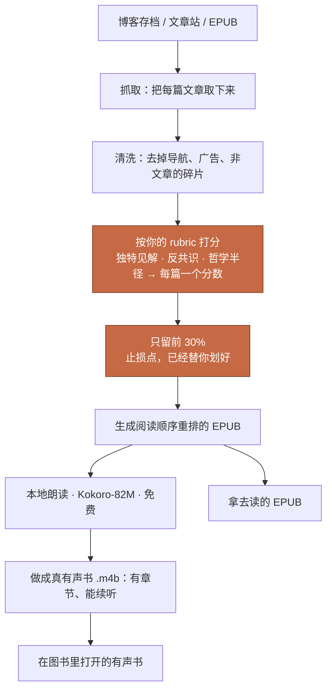

# Read the Best First（从最精彩的读起）

[English](README.md) | 中文

一套 Claude Code skill：把一位作者的全部文章变成按启发度排序的有声书，由 [Kokoro-82M](https://huggingface.co/hexgrad/Kokoro-82M) 免费朗读。Kokoro 是这个项目赖以成立的开源本地 TTS 模型，在此致谢。

*一位顶尖思考者的全部作品里，真正值得花时间的有多少？*

不到一半。往往远远不到。

## 为什么做这个

在 AI 时代，瓶颈不再是信息和工具。瓶颈是我们自己。所以理性的做法是向最强的人学习，用最短的时间吸收他们的精髓。

但再顶尖的头脑也活在自己的 bubble 里。把任何一位在一个领域深耕几十年的作者的全部作品压缩一下，剩下的是一小撮真正的精华。其余的部分在重复精华，或者把精华商业化。这不是贬低，职业生涯本来就是这样运转的。这意味着，任何作者发表的大部分东西，都不是读者要找的那部分。

所以读任何作品集都存在一个 **break-even point（止损点）**，时间的回报从这一刻起归零。这个点无法预先算出，只能在阅读中感觉到。能做的是让这个点主动走过来：所有文章按启发度降序排列，从最上面读起。边际价值开始衰减，就把书放下。停下之后的部分，本来就只会更弱，这是排序保证的。

这也是为什么按时间排序（所有博客存档和文集的默认排法）对时间稀缺的读者是错的。也是为什么这件事现在才变得可行：让 LLM 读进 232 篇文章再排序，只需要几分钟和几美分。

还有一点，而且是整个 repo 的核心：排序跑在一个 rubric 上，而 **rubric 是因人而异的**。我的 rubric 打三个维度的分，独特见解、反共识深度、哲学半径，因为这是我想最先读到的东西。你的不一样。

> [!IMPORTANT]
> **rubric 不是配置项，rubric 就是产品本身。**
> 用这个 repo 的第一件事就是打开 [`rubrics/inspiration.md`](rubrics/inspiration.md)，把维度、权重、veto、计分方式换成你自己的。

## 是什么

这个工具为**精选的博客与文章合集**而生：把一个作者的文章存档丢给它，LLM 通读每篇的开头并按启发度打分排序，产出一本阅读顺序重排过的 EPUB 和一本真正的 .m4b 有声书（能按章跳、记得听到哪，不是一坨 65 小时的音频）。最精彩的排最前面，边际价值耗尽的地方就是终点。默认交给你的是**前 30%**那一本，止损点已经替你划好，完整排序留作存档。Paul Graham 的 232 篇文章就是这样跑出来的，结果贯穿这份 README。

它也能把一本普通的书 EPUB 转成有声书。这个通用性是白送的，同一套架构的自然延伸：有作者叙事顺序的书，排序环节自动让位，其余流水线（清洗、构建、合成）原样运行。但这个工具存在的理由是文章合集，因为合集的默认阅读顺序天生是坏的。

## 流程

高亮的那一步才是属于你的：rubric。其余都是水管。

## 一次真实运行的产出

对着 [Paul Graham 的文章存档](https://paulgraham.com/articles.html)（抓取 232 篇，约 59 万词，和《魔戒》全文差不多长；清洗阶段的 article gate 挡掉了两篇非文章的 stub，230 篇进入排序），流水线产出了一本 65 小时、231 个章节标记的有声书，全程在一台 Mac 上由 Kokoro-82M 本地合成，零 API 成本。

排名样例和三个维度的评分（完整 232 篇的记录在 [examples/paul-graham/](examples/paul-graham/)）：见英文版 README 的表格，数据同一份。几个值得吵的位次：How to Do Great Work 排第 5，维度分解释了原因（contrarian 只有 5，但 reach 是 9，judge 判定 reach 赢）；Write Simply 排 136；Founder Mode 排 39（真反共识但没展开）。

还有一个诚实的发现：**judge 本身也是品味的一部分**。同一个 rubric，中档模型把 Keep Your Identity Small 排第 1；换更强的 judge，它落到 18。没有中立的排序，所以排序就应该是你自己的。

rubric 就是产品本身，证据：同一批文章换 [operator rubric](rubrics/operator.md)（可操作/具体/恒久）重排，前 15 名只剩 5 个重合，[两本书并排对比在这里](examples/paul-graham/rubric-comparison.md)。对某个位次不服？很好。那个不服就是你在发现自己的 rubric。写下来，换进去，重跑。

诚实声明：judge 读的是每篇的开头约 450 词，不是全文；分数是一个模型对一个人的 rubric 的判断。把产出当作一个强默认排序来批准或调整，不要当作真理。

## 怎么用

这份 README 是写给你的，操作手册是写给你的 coding agent 的。Clone 这个 repo，用 Claude Code（或任何会读 skill 的 agent）打开，说你想干什么，比如"把这个博客做成按启发度排序的有声书"。剩下的 agent 自己看着办，只有三件事它必须回来问你。

| 你想 | 你的 agent 打开 |
|---|---|
| 书或博客 → 清洗、排序的 EPUB + 有声书 | `skills/curated-epub-audiobook/SKILL.md` |
| 部署本地 TTS 模型（Kokoro-82M） | `skills/kokoro-local-tts/SKILL.md` |
| 改排序 rubric（先做这个） | `rubrics/inspiration.md`（独立文件：维度、权重、veto、计分方式） |
| 从有序 manifest 构建 EPUB | `scripts/build_epub.py` |
| EPUB → 带章节标记的 .m4b | `scripts/epub2m4b.py` |
| 访谈/播客转录稿 → 多声音有声书 | `scripts/transcript_cast.py` |
| 看一次真实的排序结果 | `examples/paul-graham/` |

## 只有你能做的三件事

- **改 rubric**。什么算"有启发"，只有你能定义
- **批准排序**。要在几小时的合成开始之前
- **挑朗读音色**。先让 agent 合成 3 章的样品，听过再跑全书

## License

MIT
